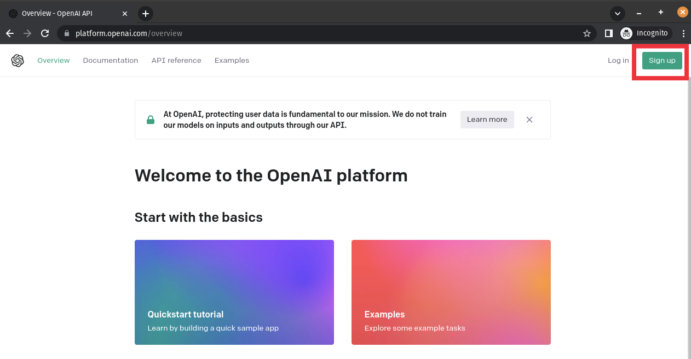
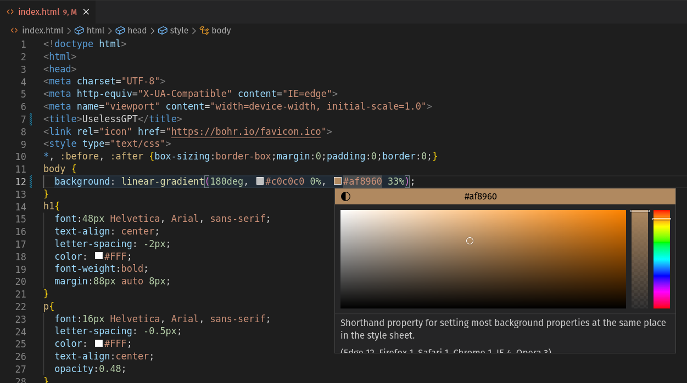

# UselessGPT - Workshop

Este projeto sugere aplicativos inúteis usando IA!

## Como funciona?

Este projeto usa a [API OpenAI GPT-3](https://openai.com/api/) e o [bohr.io functions](https://bohr.io).

## Deploy em 1-click

Faça deploy usando o [bohr.io](https://bohr.io):

[](https://bohr.io/createRepository?sampleUrl=https://github.com/bohr-io/openai-template)

Para este template você também precisará criar uma conta na [OpenAI](https://beta.openai.com/account/api-keys) e gerar um access token. Atualmente a OpenAI está dando US$18 de crédito para novas contas, aproveite!

## Para rodar localmente

Depois de fazer o deploy pelo bohr, acesse o repositório que será criado na sua conta do Github, faça clone e rode:

```bash
npx -y bohr@latest dev
```


# Instruções do Workshop Completo

Para criar a nossa aplicação inútil nós precisaremos das seguintes ferramentas:

- ChatGPT (conta de desenvolvedor/API)
- Github (conta)
- [Bohr.io](http://bohr.io) (conta)
- [Discord Bohr.io](https://bit.ly/bohriodiscord) 
- Git Instalado - ([https://git-scm.com/book/pt-pt/v2/Começando-Instalar-o-Git](https://git-scm.com/book/pt-pt/v2/Come%C3%A7ando-Instalar-o-Git))
- NPM / NPX ([https://nodejs.org/en](https://nodejs.org/en))
- VSCode ([https://code.visualstudio.com/download](https://code.visualstudio.com/download))

## ChatGPT

Para criarmos nosso app será necessário uma conta de desenvolvedor na OpenAI para acessarmos a API do ChatGPT.

Caso você ainda não possua uma conta de desenvolvedor no OpenAI, acesse o link [https://platform.openai.com/overview](https://platform.openai.com/overview) e clique no botão Sign up



Ao criar uma conta, será liberado uma Trial gratuita. Mas talvez seja necessário a utiliação de um cartão de crédito para autorização. Nesse caso, você pode utilizar os cartões de crédito abaixo para o workshop (com 2 USD de limite em cada, válidos por 7 dias apenas e limitados apenas a OpenIA):

```bash
Nome:Lucas Dorneles Boemeke
Endereço:
548 Market St PMB 91990
San Francisco, California 94104-5401 US

5342711053055503
08/23 - 603

5342711045669239
08/23 - 524

5342711071540213
08/23 - 702

5342711062938574
08/23 - 265

5342711024800565
08/23 - 209
```

Após finalizar o registro, clique no seu perfil no canto superior direito e selecione View API keys


Clique em Create new secret key, de um nome para a chave e, após a criação anote a chave gerada em um bloco de notas:


## Bohr.io

[Bohr.io](http://Bohr.io) é uma plataforma serveles Brasileira voltada ao deploy de serviços com facilidade.

Eles já possuem um template de aplicação com ChatGPT chamada SloganCreator e é por isso que vamos utiliza-la.

Para isso, acesse o Bohr.io, em Join Now, depois clique no canto direito em Login e autorize o acesso na sua conta do Github.


Depois de efetuar o Login, acesse o menu esquerdo e clique em Projects. 


Você será redirecionado para uma página contendo os projetos que estão vinculados ao seu perfil. Clique em Add New Project:


Agora você será redirecionado para a página de Templates. Use os botões Ctrl+F para buscar pelo termo slogan e selecione o **openai-template** do Slogan Generator:


Na página de criação de projeto, escolha um subdomínio (1), um nome para o repositório no github que será criado (2) e por fim, adicione a OpenAI Key que foi gerada nos passos anteriores (3). Clique em Publish (4).


Você será redirecionado para a página de Overiew do projeto. Você pode acessar o seu template (com o domínio [bohr.io](http://bohr.io)) cliando em View Project.

Copie os comandos da seção [localhost](http://localhost) e vamos utiliza-los para instanciar o deploy local da apliação.


## VSCode

Abra o VSCode em uma pasta qualquer, rode o comando git clone e entre na pasta com cd, depois execute o comando npx para rodar a instancia localmente.

```bash
git clone https://github.com/seuUsuario/SeuRepositorio.git
cd SeuRepositorio
npx -y bohr@latest dev
```

Você verá que foi baixado uma estrutura de arquivos semelhante a abaixo:


Após a execução do comando npx, a aplicaçao original (Slogan Generator) será aberta automaticamente em seu navegador (caso não seja, voce pode acessa-la com o link [http://localhost:1024](http://localhost:1024) )


Vamos agora para a edição da aplicação.

## Customizando o prompt

A “mágica” dessa aplicação se da a partir do prompt. Você pode encontra-la na linha 148 e edita-la a vontade.

Perceba que o princípio dess aplicação está em autocompletar uma frase inicial do próprio sistema (prompt) com o resto da frase inserida pelo usuário na text box.

Realize alguns testes (sempre salvando o arquivo, atualizando a página aberta no seu navegador e testando as respostas) até encontrar a melhor combinação para a sua proposta de aplicação.


## Customizando o HTML

Vamos editar o arquivo index.html para customizar nossa página html.

Troque o título da página na linha 7:


Adicione um novo header (h2) na linha 22 para dar as instruções ao usuário da página:

```bash
h2{
  font:28px Helvetica, Arial, sans-serif;
  text-align: center;
  letter-spacing: -2px;
  color: #ffffff;
  font-weight:bold;
  margin:32px auto 8px;
}
```


Altere os textos da página (a partir da linha 167 a 175) seguindo os exemplos abaixo:


Fique a vontade para realizar novas alterações na página.

### Dica #1:

Você pode utilizar o VSCode para alterar as cores das páginas, simplesmente identificando uma cor no html, clicando com o mouse e selecionando a nova cor:



### Dica #2:

Você pode utilizar o próprio ChatGPT para te ajudar a customizar a página HTML 🙃

## Commit e Deploy

O [Bohr.io](http://Bohr.io) é integrado diretamente com o repositório git utilizado na configuração. Com isso, para atualizar a página no link externo, basta fazer um git add, git pull e git comit no terminal

```bash
git add .
git commit -m "Subindo app"
git push
```


Depois basta acessar a página criada no [Bohr.io](http://Bohr.io) (suaaplicacao.bohr.io) ou clicar em View Project (no bohr.io) e clicar no botao de link externo:


Parabéns! Agora você já possui seu próprio app inútil!


## Extra:

É possível redirecionar seu próprio domínio para a sua aplicacão. Para isso, basta acessar o menu esquerdo do bohr.io, clicar em Domains > Add Domain e seguir as instruções.

